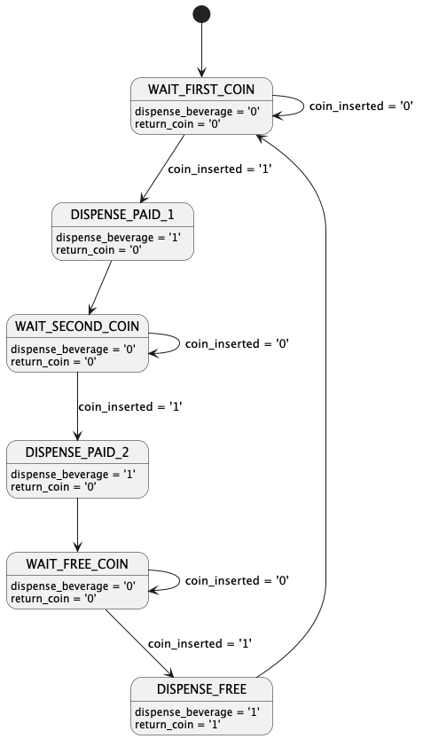

# Vending machine FSM

I recently heard the story of how the price for Coke didn't change for
over 70 years.  As late as 1959, you could buy a 6.5 ounce Coca Cola for
a nickel. This price wasn't sustainable and at one point, the company
discussed raising the price, but their vending machines had a problem:
they could only handle accepting a single coin.

Executives at Coca Cola thought that increasing the price to 10¢ was far
too much, and even asked the U.S. Treasury to begin minting a special
7 1/2 cent coin.  This didn't happen, so someone came up with the crazy
idea that they would load every 9th bottle in the vending machine with
an empty bottle, forcing the vending machine user to put in another coin
to get their drink.  This would have the effect of raising the price to
just shy of 6 cents per bottle.

Of course, the 9th person would be pretty angry. What if we increase the
price to 10 cents, but every 3rd person gets a free coke - making the
average price just a little more than 6 cents?

https://en.wikipedia.org/wiki/Fixed_price_of_Coca-Cola_from_1886_to_1959#Attempts_to_raise_prices

Luckily, our single coin vending machine has an FPGA built-in and we can
write a solution that does this in VHDL.  This repo contains a sample
of a finite state machine in VHDL, a testbench, and a Makefile that uses
GHDL to simulate it.

## State machine 



## Testing with docker

```
$ docker run -it --rm -v $(pwd):/workspace  -w /workspace ghdl/ext bash -c "make"
ghdl -a  vending_machine_tb.vhd
ghdl -e  vending_machine_tb
./vending_machine_tb --vcd=vending_machine_tb.vcd
vending_machine_tb.vhd:57:11:@4ns:(report note): Cycle 1: Dispensed a beverage (paid).
vending_machine_tb.vhd:57:11:@8ns:(report note): Cycle 2: Dispensed a beverage (paid).
vending_machine_tb.vhd:55:11:@12ns:(report note): Cycle 3: Dispensed a FREE beverage!
vending_machine_tb.vhd:57:11:@16ns:(report note): Cycle 4: Dispensed a beverage (paid).
vending_machine_tb.vhd:57:11:@20ns:(report note): Cycle 5: Dispensed a beverage (paid).
vending_machine_tb.vhd:55:11:@24ns:(report note): Cycle 6: Dispensed a FREE beverage!
vending_machine_tb.vhd:57:11:@28ns:(report note): Cycle 7: Dispensed a beverage (paid).
vending_machine_tb.vhd:57:11:@32ns:(report note): Cycle 8: Dispensed a beverage (paid).
vending_machine_tb.vhd:55:11:@36ns:(report note): Cycle 9: Dispensed a FREE beverage!
vending_machine_tb.vhd:70:5:@38ns:(report note): Vending machine testbench finished successfully.
```
